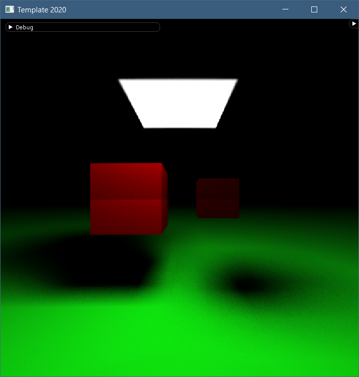
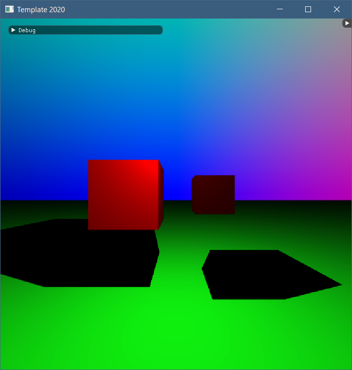
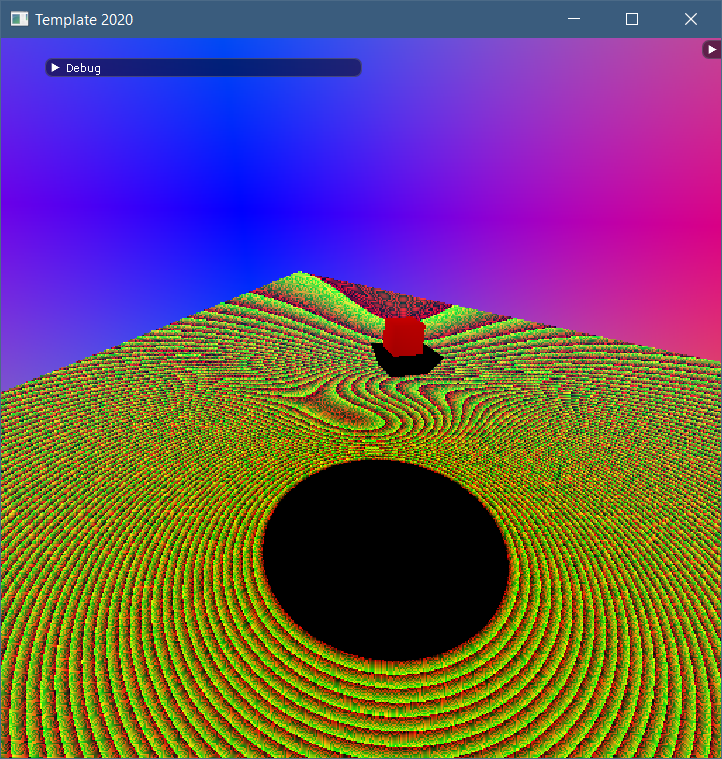
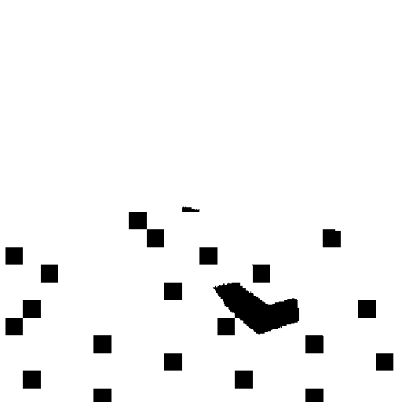
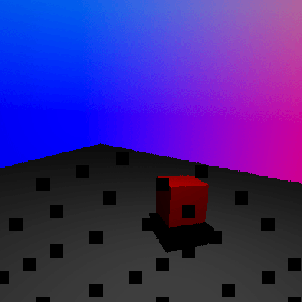

## What is this project
These are my results following the 7 day workshop on ray tracing given by [Jacco Bikker](https://github.com/jbikker) at BUas. 

## Some words about what the repository contains
The code is in a very messy state and I probably won't be refactoring it soon. In this period, I've learned a log about graphics and the concept that is ray tracing. 

The project also features a path tracing branch although some features of it are still broken. 

I've marked silly artifacts with tags as well as the end of every day. Mostly for reference purposes.

## Build instructions
Finally, you can open the project by opening the tmpl_2020-01.sln file with I think any Visual Studio version (I used 2019).

## Features
* My project runs at a very simple scene (14 triangles) at around 130 fps on a resolution of 512x512. 
* Multithreading. 
* AA. 

On branch path tracer
* Soft shadows 
* Supposed to support DOF, but it looks a bit inaccurate.

Some images:

